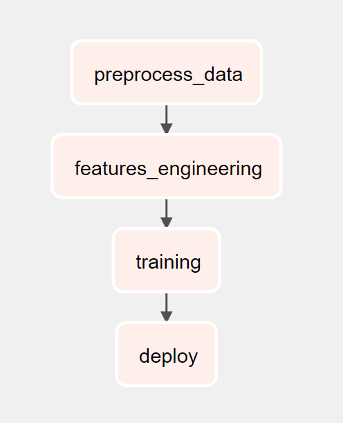
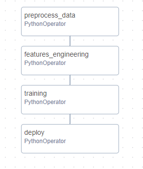
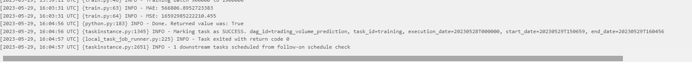
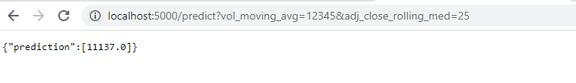

# Airflow Trading Volume Prediction Data Pipeline

This project combines an Airflow data pipeline and a Flask API for processing financial data.

## Table of Contents

- [Airflow Trading Volume Prediction Data Pipeline](#airflow-trading-volume-prediction-data-pipeline)
  - [Table of Contents](#table-of-contents)
  - [Project Description](#project-description)
  - [Airflow Data Pipeline](#airflow-data-pipeline)
  - [Flask API](#flask-api)
  - [Installation](#installation)
  - [Docker Instructions](#docker-instructions)
  - [Flask Instructions](#flask-instructions)
  - [Usage](#usage)

## Project Description

This project aims to process and analyze financial data using an Airflow data pipeline and provide access to the processed data through a Flask API. The pipeline fetches financial data from Kaggle, preprocesses it, and stores it in a parquet, does feature engineering and uses RandomForestRegressor from scikit-learn and deploys the model to AWS S3. The Flask API allows users to predict Volume based on vol_moving_avg and adj_close_rolling_med.

The project leverages the following technologies and frameworks:

- Apache Airflow: A platform for programmatically authoring, scheduling, and monitoring workflows.
- Flask: A micro web framework for building APIs.
- PostgreSQL: An open-source relational database management system, as the database for Airflow
- Docker: A containerization platform for packaging the project into portable containers.

## Airflow Data Pipeline

The Airflow data pipeline consists of the following components:

- DAG (Directed Acyclic Graph): The DAG defines the workflow and task dependencies for processing financial data. It schedules and orchestrates the tasks required to fetch, preprocess, and store the data.
- Data Fetching Task: This task fetches financial data from various sources, such as APIs or files, and saves it to a local directory.
- Data Preprocessing Task: This task reads the fetched data, performs necessary transformations and cleaning, and prepares it for storage.
- Database Storage Task: This task connects to the PostgreSQL database and stores the preprocessed data in appropriate tables.

The pipeline runs on a schedule or can be triggered manually, ensuring that the financial data is regularly updated and available for analysis.

## Flask API

The Flask API provides access to the processed financial data and prediction capabilities. It exposes the following endpoints:

- `/predict`: Accepts input parameters vol_moving_avg and adj_close_rolling_med and performs predictions for Volume based on the preprocessed data.

To use the API, make HTTP requests to the appropriate endpoints and provide any necessary input parameters. The API responds with the Volume prediction.

## Installation

Download the ETF and stock datasets from the primary dataset available at <https://www.kaggle.com/datasets/jacksoncrow/stock-market-dataset>.

To set up the project locally, follow these steps:

## Docker Instructions

To run the project using Docker, follow these steps:

1. Install Docker on your machine.
2. Build the Docker image: `docker compose up`

## Flask Instructions

1. Install the required dependencies: `pip install -r requirements.txt`
2. Run `python app.py`

The Flask API will be available at `http://localhost:5000`. You can now make HTTP requests to the API endpoints to retrieve financial data or make predictions.

## Usage

Once the project is installed and running, you can interact with it in the following ways:

1. Access the Airflow web interface: Open a web browser and navigate to `http://localhost:8500` to view and manage the Airflow DAGs.
2. Use the Flask API: Make HTTP requests to the API endpoints to retrieve financial data or perform predictions. Refer to the API documentation for the available endpoints and expected input/output formats.

`# hypothetical HTTP GET request and response
GET /predict?vol_moving_avg=12345&adj_close_rolling_med=25
-> 10350`
